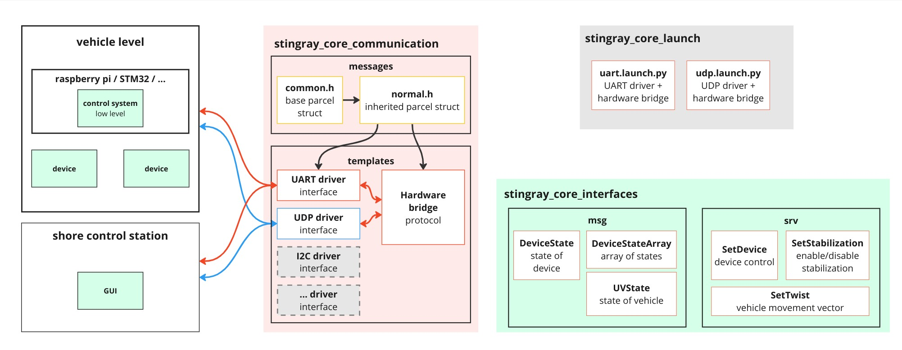

# stingray_core

> UDP, UART drivers for different tasks: communication between upper and lower level control systems, betwen control system and device, between vehicle and shore remote control station. Part of [Stingray framework](https://github.com/hydronautics-team/stingray)

**hardware_bridge** - middle layer between low level protocol (UART, UDP, ...) and ROS communication.

**uart_driver** - implementation of low level communication via UART

**udp_driver** - implementation of low level communication via UDP



## Dependencies

- [serial](https://github.com/jinmenglei/serial.git) - for communication with stm32 and etc.


## Docker

run

```bash
./docker_run.sh
```

rebuild

```bash
./docker_build.sh
```

## Basic usage

### Example: run UART driver 

**From command line:**

```bash
ros2 launch stingray_core_communication uart_driver_node
```

**From launch file:**

The example in [uart.launch.py](src/stingray_core_launch/launch/uart.launch.py)

**Arguments:**

- **driver_request_topic** - from which topic to get input parcel
- **driver_response_topic** - to which topic to put the output parcel from device
- **device** - device path. '/dev/ttyUSB0'
- **baudrate** - uart baud
- **data_bits** - uart data bits value
- **stop_bits** - uart stop bits value
- **parity** - uart parity
- **serial_timeout** - serial timeout

### Example: run UART driver with hardware bridge

```python
from launch.actions import IncludeLaunchDescription
from launch import LaunchDescription
from launch.launch_description_sources import PythonLaunchDescriptionSource
from launch.substitutions import LaunchConfiguration

return LaunchDescription([
    IncludeLaunchDescription(
        PythonLaunchDescriptionSource(str(Path(
            get_package_share_directory('stingray_core_launch'), 'uart.launch.py'))),
        launch_arguments={
            'driver_request_topic': LaunchConfiguration("driver_request_topic"),
            'driver_response_topic': LaunchConfiguration("driver_response_topic"),
            'uv_state_topic': LaunchConfiguration("uv_state_topic"),
            'device_state_array_topic': LaunchConfiguration("device_state_array_topic"),
            'set_twist_srv': LaunchConfiguration("set_twist_srv"),
            'set_stabilization_srv': LaunchConfiguration("set_stabilization_srv"),
            'reset_imu_srv': LaunchConfiguration("reset_imu_srv"),
            'enable_thrusters_srv': LaunchConfiguration("enable_thrusters_srv"),
            'set_device_srv': LaunchConfiguration("set_device_srv"),
            'device': LaunchConfiguration("device"),
            'baudrate': LaunchConfiguration("baudrate"),
        }.items(),
    ),
])
```

## Custom message

### 1. Create custom package

- custom_communication/
  - include/
    - custom_communication/messages/
      - **custom.h**
  - src/
    - messages/
      - **custom.cpp**
    - **udp_driver_node.cpp**
  - **CMakeLists.txt**
  - **package.xml**

### 2. Create message

**custom.h**

```cpp
#include "stingray_core_communication/messages/common.h"

class CustomMessage : public AbstractMessage {
public:
    CustomMessage();

    const static uint8_t length = 12; // 10(message) + 2(checksum) = 12 dyte
    static const uint8_t dev_amount = 2;
    static const uint8_t char_amount = 3;

    uint8_t uint_value;
    float float_value; 
    uint8_t dev[dev_amount];
    char char_seq[char_amount];

    uint16_t checksum;
    // parsel end

    void pack(std::vector<uint8_t> &container) override; 
    bool parse(std::vector<uint8_t> &input) override; 
};
```

**custom.cpp**

```cpp
#include "custom_communication/messages/custom.h"

CustomMessage::CustomMessage() : AbstractMessage() {
    uint_value = 0;
    float_value = 0.0;
    for (int i = 0; i < dev_amount; i++) {
        dev[i] = 0;
    }
    for (int i = 0; i < char_amount; i++) {
        char_seq[i] = 0;
    }

    checksum = 0;
}

// form byte-vector (raspberry_cm4 to STM) // TODO
void CustomMessage::pack(std::vector<uint8_t> &container) {
    pushToVector(container, uint_value);
    pushToVector(container, float_value);
    for (int i = 0; i < dev_amount; i++) {
        pushToVector(container, dev[i]);
    }
    for (int i = 0; i < char_amount; i++) {
        pushToVector(container, char_seq[i]);
    }

    uint16_t checksum = getChecksum16b(container);
    pushToVector(container, checksum);  // do i need to revert bytes here?
}

// pull message from byte-vector (pult to raspberry_cm4)
bool CustomMessage::parse(std::vector<uint8_t> &input) {
    popFromVector(input, checksum, true);
    uint16_t checksum_calc = getChecksum16b(input);
    // if (checksum_calc != checksum) {
    //     return false;
    // }
    for (int i = 0; i < char_amount; i++) {
        popFromVector(input, char_seq[char_amount - i - 1]);
    }
    for (int i = 0; i < dev_amount; i++) {
        popFromVector(input, dev[dev_amount - i - 1]);
    }
    popFromVector(input, float_value);
    popFromVector(input, uint_value);

    return true;
}
```

### 3. Use message with UDP driver

**udp_driver_node.cpp**

```cpp
#include "stingray_core_communication/udp_driver.h"
#include "custom_communication/messages/custom.h"

int main(int argc, char *argv[]) {
    rclcpp::init(argc, argv);
    rclcpp::executors::MultiThreadedExecutor executor;
    boost::asio::io_service io_service;
    std::shared_ptr<rclcpp::Node> sender_node = rclcpp::Node::make_shared("UDPDriverSender");
    auto sender = UDPBridgeSender<CustomMessage>(sender_node, io_service);
    std::shared_ptr<rclcpp::Node> receiver_node = rclcpp::Node::make_shared("UDPDriverReceiver");
    auto receiver = UDPBridgeReceiver<CustomMessage>(receiver_node, io_service);
    std::thread s([&] {
        receiver.try_receive();
        io_service.run();
        });
    executor.add_node(sender_node);
    executor.add_node(receiver_node);
    executor.spin();
    rclcpp::shutdown();
    return 0;
}
```
### 4. Change CMakeLists.txt

Add this lines to **CMakeLists.txt**

```cmake
find_package(stingray_core_interfaces REQUIRED)
find_package(stingray_core_communication REQUIRED)
find_package(serial REQUIRED)
find_package(Boost REQUIRED COMPONENTS system)
find_package(std_msgs REQUIRED)
find_package(std_srvs REQUIRED)
```

```cmake
add_executable(udp_driver_node
        src/udp_driver_node.cpp
        include/welt_communication/messages/welt.h
        src/messages/welt.cpp
        )
ament_target_dependencies(udp_driver_node rclcpp Boost std_msgs std_srvs serial stingray_core_interfaces stingray_core_communication)
```

```cmake
## Install executable
install(TARGETS
        hardware_bridge_node
        udp_driver_node
        # ${PROJECT_NAME}
        DESTINATION lib/${PROJECT_NAME}
        # EXPORT ${PROJECT_NAME}
        # LIBRARY DESTINATION lib
        # ARCHIVE DESTINATION lib
        # RUNTIME DESTINATION bin
        # INCLUDES DESTINATION include
)
```

### 5. Change package.xml

**package.xml**

```xml
<depend>std_msgs</depend>
<depend>std_srvs</depend>
<depend>serial</depend>
<depend>stingray_core_interfaces</depend>
<depend>boost</depend>
<depend>stingray_core_communication</depend>
```
